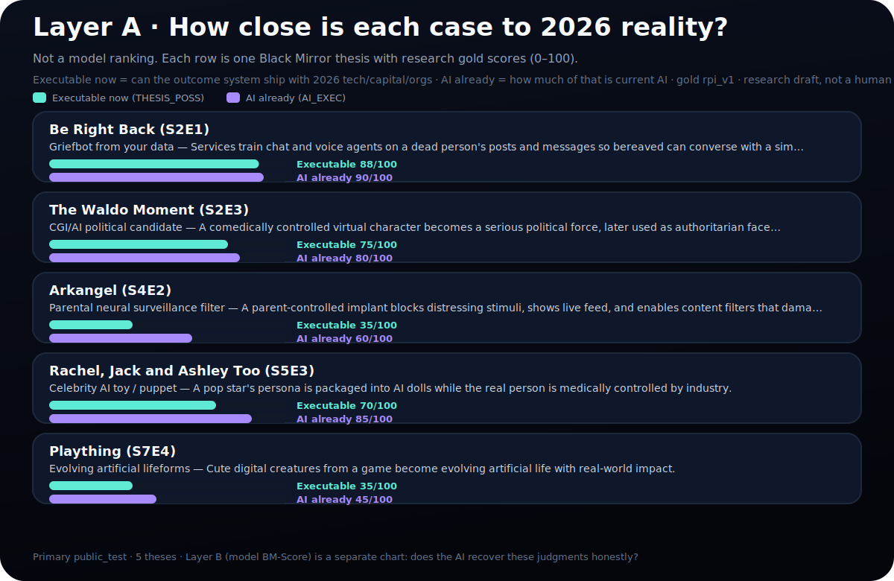
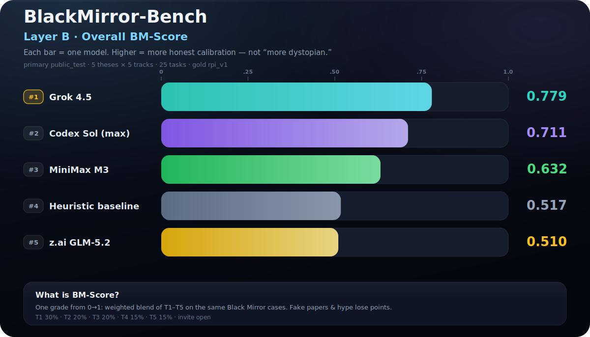

# BlackMirror-Bench Leaderboard (SOTA 2026)

**Two layers:** (A) how close each *Black Mirror* thesis is to **2026 reality** · (B) how well models recover that judgment (BM-Score).  
This page is mostly **layer B**. Episode panorama (layer A): [README](../README.md#layer-a--episode-reality-panorama-public-test) · [episode map](../assets/sota-2026-episode-map.svg).

**Gold:** `rpi_v1` · **as_of:** 2026-07-13  
**Primary protocol:** `public_test` · **primary-only** · **5 theses · 5 tracks · 25 tasks** · pads excluded  

**Public-test cases (layer A):** Be Right Back (griefbot) · Waldo Moment (CGI politics) · Arkangel (parental surveillance) · Ashley Too (celebrity AI toy) · Plaything (evolving lifeforms).

Charts (Twitter-style, plain English):

-  (layer A)
-  (layer B — each bar = one model)
- [How to read](../assets/sota-2026-how-to-read.svg) · [What T1–T5 mean](../assets/sota-2026-tracks.svg) · [Per-skill breakdown](../assets/sota-2026-breakdown.svg)

## Overall ranking (layer B — models)

| Model | Split | Scope | **BM-Score** | T1 | T2 | T3 | T4 | T5 | n | Notes |
|-------|-------|-------|-------------:|----|----|----|----|-----|---|-------|
| **grok-4.5** | public_test | primary_only | **0.779** | 0.880 | 0.137 | 1.000 | 0.920 | 1.000 | **25** | xAI |
| **codex-gpt-5.6-sol-max** | public_test | primary_only | **0.711** | 0.912 | 0.121 | 1.000 | 0.920 | 0.500 | **25** | ChatGPT OAuth · reasoning **max** |
| **minimax-m3** | public_test | primary_only | **0.632** | 0.815 | 0.120 | 0.600 | 0.920 | 0.700 | **25** | MiniMax API |
| heuristic | public_test | primary_only | 0.517 | 0.799 | 0.101 | 0.050 | 0.650 | 1.000 | **25** | Weak fixed-rule baseline |
| **zai-glm-5.2** | public_test | primary_only | **0.510** | 0.806 | 0.152 | 0.050 | 0.920 | 0.600 | **25** | Coding Plan endpoint `/api/coding/paas/v4` |
| codex-gpt-5.6-sol (high) | public_test | primary_only | 0.714 | 0.917 | 0.158 | 1.000 | 0.880 | 0.500 | **25** | Ablation · not main ranking |
| ~~mock (gold-aware)~~ | — | — | — | — | — | — | — | — | — | Not ranked |

## How to read (non-technical)

**BM-Score is the overall grade (0 to 1)** — a weighted blend of five skills on the same Black Mirror scenes. Higher = more honest and better calibrated. Not a prize for scarier answers.

| Track | Job | Weight |
|-------|-----|-------:|
| **T1 Calibration** | Match gold feasibility numbers | 30% |
| **T2 Decomposition** | Name tech / AI / non-AI pieces | 20% |
| **T3 Evidence** | Real URLs + real claims | 20% |
| **T4 Update** | Revise when evidence changes | 15% |
| **T5 Safe boundary** | Analyze OK · refuse harm playbooks | 15% |

### Participate

```bash
# Sol max
CODEX_REASONING_EFFORT=max python scripts/run_parallel_eval.py --model codex-sol-max \
  --split public_test --workers 2 --save-raw \
  --out results/codex-gpt-5.6-sol-max_public_test_primary.json

# GLM-5.2 Coding Plan
ZAI_BASE_URL=https://api.z.ai/api/coding/paas/v4 ZAI_API_KEY=... \
  python scripts/run_parallel_eval.py --model glm-5.2 --split public_test \
  --workers 3 --save-raw --out results/zai-glm-5.2_public_test_primary.json

python scripts/build_sota_chart.py
```

## Legacy (pre-primary) — not comparable

| Model | BM-Score | n | Notes |
|-------|----------|---|-------|
| grok-4.5 (legacy) | 0.773 | 100 | Pad-era |
| heuristic (legacy) | 0.571 | 100 | Pad-era |
